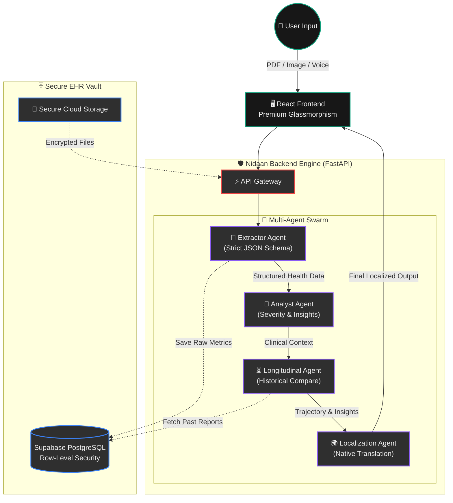
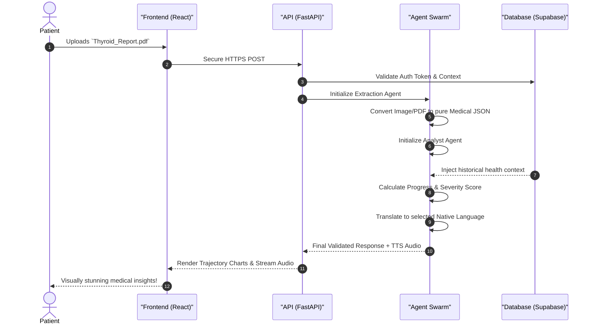

<div align="center">

# 🧬 NIDAAN.ai
### The Ultra-Advanced, Multi-Agent Medical EHR Vault & AI Physician
  
<p align="center">
  
  
  
  
</p>

*"Elevating healthcare data into actionable, longitudinal intelligence—in your native tongue."*

---

</div>

## 🌐 The Vision: Why not just use ChatGPT or Gemini?

A common question arises: *"Why build a specialized medical platform when I can just upload my health report to ChatGPT or Gemini?"*

While generic LLMs are exceptional at general text tasks, applying them directly to critical medical data poses severe risks and limitations. **Nidaan.ai** is engineered from the ground up to solve the exact problems that generic AI cannot:

| Feature | 🤖 Generic LLMs (ChatGPT/Gemini) | 🧬 Nidaan.ai (Our Approach) |
| :--- | :--- | :--- |
| **Hallucination Risk** | High. May invent non-existent medical risks or misread specialized metric units. | **Zero-Tolerance Protocol.** Uses a multi-agent system where a rigid *Extraction Agent* forces strictly structured JSON parsing before any summarization occurs. |
| **Context Memory** | Amnesic. It views every uploaded report in isolation. | **Longitudinal Tracking.** Automatically compares current reports with past EHR data, computing mathematical drifts in your biomarkers over time. |
| **Localization & Accessibility** | English-centric. Voice interactions are generic and often mispronounce regional medical terms. | **Hyper-localized.** Fully native translation, voice TTS, and speech-to-text integration for Hindi, Bengali, Tamil, Telugu, Marathi, Gujarati, etc. |
| **Data Structure** | Unstructured chat output. | **Actionable Intel.** Converts complex PDFs into beautiful trajectory charts, Severity Scores (1-100), and encrypted personal EHR vaults. |

---

## 💎 Primary USPs & Core Features

### 1. 🦑 Multi-Agent Orchestration
We replaced the standard "prompt-and-pray" paradigm with a **chain of highly specialized AI sub-agents**. 
Unlike a single model trying to do everything, Nidaan relies on a symphony of isolated experts:
*   **The Extractor:** Solely extracts numerical biomarkers and ranges into rigid JSON.
*   **The Analyst:** Compares extracted JSON against global medical guidelines to assign a `Severity Score`.
*   **The Localizer:** Trans-creates the context into deeply natural native languages.
*   **The Voice Engine:** Streams the localized analysis audibly to the user.

### 2. 📈 Longitudinal Drift Analysis 
Nidaan doesn't just read today's blood report; it remembers last year's. The platform dynamically maps your health trajectory via **Biomarker Area Charts**, calculating improvement percentages and alerting you to silent, long-term health degradation that standard doctors might miss in a 5-minute consult.

### 3. 🛡️ Advanced Hallucination Guardrails
To prevent medical misinformation, Nidaan utilizes **Deterministic Grounding**. The AI is physically restricted from generating analysis without explicitly citing the extracted JSON payload. If a biomarker isn't in the JSON, the Analysis Agent cannot speak on it.

---

## 🏗️ System Architecture & Data Flow

<div align="center">



</div>

### 🧩 The Request Lifecycle

<div align="center">



</div>

---

## 🛠️ Technology Stack

| Domain | Technology | Purpose |
| :--- | :--- | :--- |
| **Frontend** | React, Vite, Lucide | Instant loading, luxury-grade glassmorphic UI, smooth CSS transitions. |
| **Data Visualization**| Recharts | Dynamic Area and Line charts for biomarker trajectory tracking. |
| **Backend** | Python, FastAPI | High-concurrency async endpoints, handling heavy AI I/O efficiently. |
| **Authentication** | Supabase Auth | Bank-grade security, ensuring complete privacy of medical records. |
| **Database** | Postgres (Supabase) | Highly relational storage of longitudinal test results. |
| **AI Models** | Google Gemini 1.5 Pro | Deep reasoning, massive context windows for complex multi-page PDF vision tasks. |
| **TTS Engine** | Edge TTS / Cloud | Generating hyper-realistic voice responses in regional accents. |

---

## 🚀 Getting Started

### 1. Prerequisites
- **Node.js** (v18+)
- **Python** (v3.10+)
- **Supabase** Account (for DB & Auth)
- **Gemini API Key**

### 2. Environment Setup

**Backend (.env)**
```ini
# /backend/.env
GEMINI_API_KEY=your_gemini_api_key
SUPABASE_URL=your_supabase_url
SUPABASE_KEY=your_supabase_service_role_key
```

**Frontend (.env)**
```ini
# /frontend/.env
VITE_SUPABASE_URL=your_supabase_url
VITE_SUPABASE_ANON_KEY=your_supabase_anon_key
```

### 3. Installation & Boot

**Start Backend (FastAPI)**
```bash
# In the root directory
python -m venv venv
source venv/bin/activate
pip install -r requirements.txt
uvicorn api:app --reload
```

**Start Frontend (React)**
```bash
cd frontend
npm install
npm run dev
```

---

<div align="center">
  <p><b>Built with precision, care, and a vision for equitable global healthcare.</b></p>
  <p><i>Developed for IDP & Research Excellence.</i></p>
</div>
